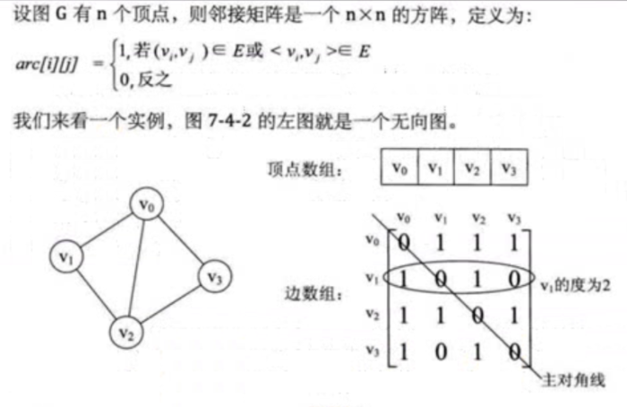
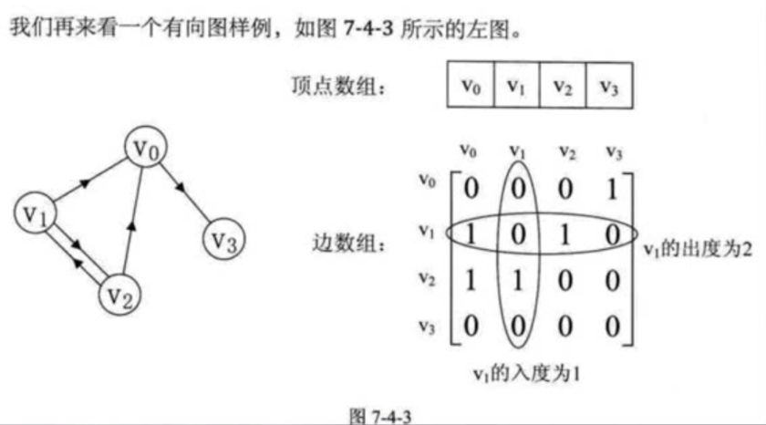
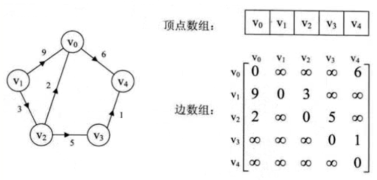
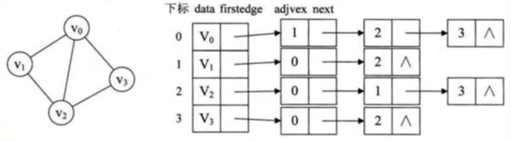
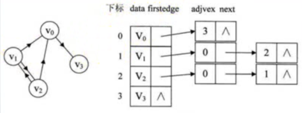
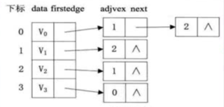
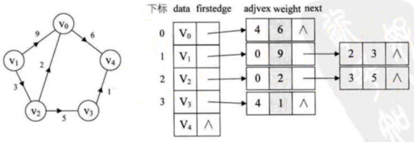

# 数据结构与算法

## 复杂度
### 时间复杂度
O(1) 、 O(log(n)) 、 O(n) 、 O(n2)
### 空间复杂度
O(1) 、 O(log(n)) 、 O(n) 、 O(n2)

## 数据
****

###　堆
****

### 栈
是一种只能在一端进行插入和删除操作的特殊线性表  
先进后出的原则存储数据  
****

### 队列
特殊之处在于它只允许在表的前端（front）进行删除操作，而在表的后端（rear）进行插入操作，和栈一样，队列是一种操作受限制的线性表  
****

### 链表
- 单链表
- 双链表
- 循环链表
****

### 树
```ts
class TreeNode {
   public data: number
   public num: number
   public leftChild: TreeNode | null
   public rightChild: TreeNode | null

   constructor(data: number) {
      this.data = data
      this.num = 1
      this.leftChild = null
      this.rightChild = null
   }
}

class BinaryTree {
   public root: TreeNode
   public order = {
      'before': ['in', 'left', 'right'],
      'after':['left', 'in', 'right'],
      'in': ['left', 'right', 'in']
   }

   constructor(initData: number = 0) {
      this.root = new TreeNode(initData)
   }
   
   public add(data: number) {
      this.compare(data, this.root)
   }

   private compare(waitData: number, node: TreeNode) {
      if (waitData === node.data) return node.num++
      // 左节点
      if (waitData < node.data) {
         node.leftChild
               ? this.compare(waitData, node.leftChild)
               : node.leftChild = new TreeNode(waitData)
      } else {
      // 右节点
         node.rightChild
               ? this.compare(waitData, node.rightChild)
               : node.rightChild = new TreeNode(waitData)
      }
   }

   public detele() {}
    
   // 基础遍历
   private baseTraverse(node: TreeNode, order: string[], findObj?: {
      rules: (node: TreeNode) => boolean,
      foundNodes: TreeNode[]
   }) {
      if (!node) return

      const traverses = new Map([
         ['left', () => this.baseTraverse(node.leftChild, order, findObj)],
         ['in', () => {
               if (findObj && findObj.rules(node)) findObj.foundNodes.push(node)
         }],
         ['right', () => this.baseTraverse(node.rightChild, order, findObj)]
      ])
      order.forEach(i => traverses.get(i)())
   }

   // 深度优先遍历的三种方式（栈）
   // 前序遍历  ['in', 'left', 'right']
   // 中序遍历  ['left', 'in', 'right']
   // 后序遍历  ['left', 'right', 'in']
   public traverse(order: string[], findObj?: {
      rules: (node: TreeNode) => boolean,
      findedCallback?: (foundNodes: TreeNode[]) => void
   }) {
      const foundNodes: TreeNode[] = []
      this.baseTraverse(this.root, order, {
         rules: findObj ? findObj.rules : () => false,
         foundNodes
      })
      findObj && findObj.findedCallback(foundNodes)
   }
   // 广度优先遍历（队列）
   // 层序遍历
   public traverseFloor(findObj?: {
      rules: (node: TreeNode) => boolean,
      findedCallback?: (foundNodes: TreeNode[]) => void
   }) {
      const queue: TreeNode[] = []
      const foundNodes: TreeNode[] = []
      queue.push(this.root)
      while (queue.length) {
         const node = queue.shift()
         findObj && foundNodes.push(node)
         node.leftChild && queue.push(node.leftChild)
         node.rightChild && queue.push(node.rightChild)
      }
      findObj && findObj.findedCallback(foundNodes)
   }
}
```
****

### 散列表
****

###　图
### 分类
- 无/有向图
- 无/有权图
### 图的一些名称
- 度
  无向：顶点的度为以该顶点为一个端点的边的数目  
        度数之和是顶点边数的两倍
  有向：有向图的全部顶点入度之和等于出度之和且等于边数。顶点的度等于入度与出度之和
  - 入度(有向图)：是以顶点为终点  
  - 出度(有向图)：是以顶点为起点
- 连通：两顶点之间有路径存在
- 连通图：图中任意两顶点都连通，同此图为连通图
- 连通分量：无向图中的极大连通子图
- 强连通：在有向图中，两顶点两个方向都有路径
### 储存
- 邻接矩阵
  邻接矩阵是一个二维数组，数据项表示两点间是否存在边，如果图中有 N 个顶点，邻接矩阵就是 N*N 的数组  
  1. 无向
     
  2. 有向
     
  3. 有向加权
     
  
- 邻接表
  每个单独的链表表示了有哪些顶点与当前顶点邻接  
  对于有向图，可分为出度邻接表和入度邻接表
  1. 无向
  
  1. 有向出度
  
  3. 有向入度
  
  4. 有向加权出度
  