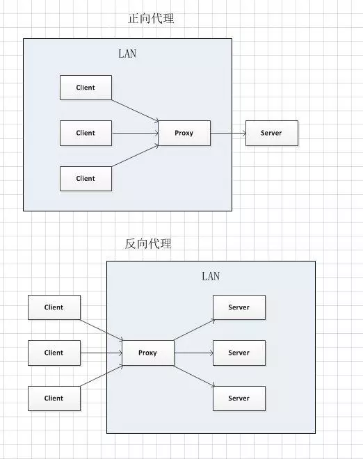

# HTTP

## 与 HTTP 协作的 Web 服务器

- 一台主机可以搭载多个 Web 站点，所以会有多个域名解析的 IP 地址为该主机 IP，在 Host 首部要完整指明主机名和域名的 URL
- 隧道：目的是保证客户端和服务器之间进行安全通信，不会对报文做修改加工
- 网关：利用网关可将 HTTP 请求转化为其他协议通信，比如，网关可以连接数据库，等
- 代理：客户端和服务器中间的中间人，可有多级代理，可以在请求中追加代理的首部信息
  - 缓存代理服务器：将从源服务器请求的资源保存在代理服务器上一份，下次访问同一资源，直接返回。用于减轻源服务器的访问压力
  - 反向代理：代理某个服务器的访问，所有用户通过正向代理服务器访问目标服务器
  - 正向代理：将用户的访问分向各个服务器集群中的某个服务器，将所有服务器的压力均衡负载  
    
  - 透明代理：不对请求报文做代理加工的叫透明代理，反之，叫非透明代理

## HTTP 的几种请求方式

- GET：数据放在 URL 的字段里，只能进行 url 编码，得到的数据会被浏览器主动缓存
- POST：数据放在 request.body 中，支持多种编码，可以设置响应头让浏览器缓存数据,请求服务器网关应用程序
- PUT：向指定位置上传资源，一般用来上传文件
- DELETE：请求服务器删除指定位置的资源
- HEAD: 同 GET，但是不返回响应体，只获取响应头的元信息，一般用于检测资源是否存在和是否有权限访问相应的资源
- OPTIONS: 返回服务器针对特定资源所支持的 HTTP 请求方法。也可以利用向 Web 服务器发送'\*'的请求来测试服务器的功能性
- TRACE: 回显服务器收到的请求，主要用于测试或诊断

## 状态吗

### 信息类状态码 1XX

1XX 接收的请求正在处理

### 成功状态码 2XX

200 OK 请求正常处理  
204 No Content 请求处理成功，但没有资源可返回  
206 Partial Content 请求（请求的是部分资源）处理成功（一般用于断点续传）

### 重定向状态码 3XX

301 Moved Permanently 当前资源已被分配了新的 URL(永久的)  
302 Found 当前资源已被分配了新的 URL(临时的)  
303 See Other  
304 Not Modified 资源找到，但请求附带的条件不满足  
307 Temporary Redirect

### 客户端错误状态码,服务器无法处理请求 4XX

400 Bad Request 请求错误，可能是请求报文中存在错误  
401 Unauthorized 需要认证，第一次请求会弹出认证窗口，第二次请求表示认证失败  
403 Forbidden 该资源不允许访问  
404 Not found 请求的资源不存在

### 服务端错误状态码,服务器请求出错 5XX

500 Internal Server Error 服务器本身发生错误(可能是 bug 或者临时故障)  
503 Server Unavailable 服务器无法处理请求，表明服务器处于超负载或者停机维护

## 首部

- 通用首部
- 请求首部
- 相应首部
- 实体首部
- 扩展首部

## 请求头

## 响应头(:后面是例子)

Access-Control-Allow-Origin #设置资源的跨域访问

- : \*
  Accept-Patch #指定服务器所支持的文档补丁格式
- : text/example;charset=utf-8
  Accept-Ranges #服务器支持的内容范围
- : bytes
  Age #设置响应在代理服务器中存在的时间(s)
- : 12(数字就行)
  Allow #特定资源的有效动作
- : GET, HEAD
  Cache-Control #缓存可用的时间
- : max-age=3600
  Connection #针对该连接所预期的选项
- : close
  Content-Disposition #对已知 MIME 类型资源的描述,浏览器可以根据这个响应头决定是对返回资源的动作，如：将其下载或是打开
- : attachment; filename="fname.ext"
  Content-Encoding #响应资源所使用的编码类型
- : gzip
  Content-Language #响应内容的语言
- : zh-cn
  Content-Length #响应消息体的长度(8 进制表示)
- : 348(数字就行)
  Content-Location #返回数据的第一个候选位置
- : /index.htm
  Content-MD5 #响应内容的二进制 MD5 散列值，以 Base64 方式编码
  Content-Range #如果是响应部分消息，表示属于完整消息的哪个部分
- : bytes 21010-47021/47022
  Content-Type #当前内容的 MIME 类型
- : text/html; charset=utf-8
  Date #此条消息被发送时的日期和时间
- : Tue, 15 Nov 1994 08:12:31 GMT
  ETag #对于某个资源的某个特定版本的一个标识符，通常是一个 消息散列
  Expires #指定一个时间,超过该时间表示过期
- : Thu, 01 Dec 1994 16:00:00 GMT
  Last-Modified #所请求的对象的最后修改日期
- : Dec, 26 Dec 2015 17:30:00 GMT
  Link #用来表示与另一个资源之间的类型关系
  Location #用于进行重定向或在创建了某个新资源时使用
- : http://www.itbilu.com/nodejs
  P3P #P3P 策略相关设置
- : CP="This is not a P3P policy!
  Pragma
  Proxy-Authenticate #要求在访问代理时提供身份认证信息
- : Basic
  Public-Key-Pins #用于防止中间攻击，声明网站认证中传输层安全协议的证书散列值
  Refresh #用于重定向，或者当一个新的资源被创建时。默认会在 5 秒后刷新重定向
- : 5; url=http://itbilu.com
  Retry-After
  Server #服务器的名称
- : nginx/1.6.3
  Set-Cookie #设置 HTTP cookie
  Status #通用网关接口的响应头字段，用来说明当前 HTTP 连接的响应状态
- : 200 OK
  Trailer #用户说明传输中分块编码的编码信息
- : Max-Forwards
  Transfer-Encoding #用表示实体传输给用户的编码形式。包括：chunked、compress、 deflate、gzip、identity
- : chunked
  Upgrade #要求客户端升级到另一个高版本协议
- : HTTP/2.0, SHTTP/1.3, IRC/6.9, RTA/x11
  Vary #告知下游的代理服务器，应当如何对以后的请求协议头进行匹配，以决定是否可使用已缓存的响应内容而不是重新从原服务器请求新的内容
- : \*
  Via #告知代理服务器的客户端，当前响应是通过什么途径发送的
- : 1.0 fred, 1.1 itbilu.com (nginx/1.6.3)
  Warning #一般性警告，告知在实体内容体中可能存在错误
- : 199 Miscellaneous warning
  WWW-Authenticate #表示在请求获取这个实体时应当使用的认证模式
- : Basic

## 应用层协议的构成

HTTP：TCP > HTTP  
HTTPS: TCP > TLS > HTTP  
WS: TCP > WS  
WSS: TCP > TLS > WS

## HTTP1.0 / HTTP1.1 / HTTP2.0 升级了什么

## 代理

- 作用:
  滤内容,阻止访问,访问控制,权限管理
- 代理的种类
  私有代理: 一个用户专用的
  公共代理: 众多客户端共享使用的
  代理缓存: 保存了服务器文件的部分副本,
  反向代理: 按需或按照流量来分配用户的访问
  转码器: 将得到的服务器上的内容做转换,
  匿名代理: 将请求报文中的身份信息删除,提供私密性和匿名性
- 还可以
  服务器设置配置,使其只接受来自代理的请求,防止用户直接连接
  安全防火墙

## 网关

一般用于不同协议之间的转化

## 其他

- MIME 类型: 是为了区分上千种资源的类型而设计的 最初在邮件系统中使用,然后 http 也使用了他
  常见的 MIME 的文件类型
- URI 统一资源标识符 有两种形式
  URL 统一资源定位符 格式:协议 地址 资源
  URN 统一资源名

## http 的各个版本

- HTTP/0.9
- HTTP/1.0
- HTTP/1.0+
- HTTP/0.9
- HTTP/2.0
